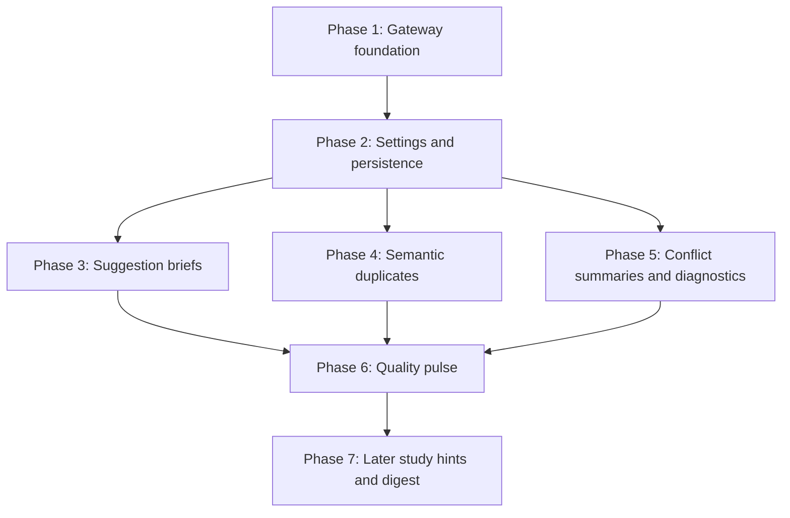

# 9Router AI Owner Assist for DeckBridge

## Description

DeckBridge should use the local or hosted 9Router gateway to add owner-controlled AI assistance across the existing Anki collaboration workflow. The first implementation should improve deck quality and reduce owner review effort without silently changing card content.

The first release must focus on:

- AI reviewer briefs for incoming suggestions.
- Semantic duplicate and related-card detection using embeddings.
- Advisory conflict summaries for sync conflicts.
- Deck quality pulse items in the Owner Attention panel.
- Setup and sync diagnostics for the Anki add-on workflow.

Study hints, owner digest, and comment-thread summarization are later slices after the advisory owner-control path is proven.

## Business Requirements

### User Stories

1. As a deck owner, I want AI to summarize incoming suggestions so I can review faster without giving up final approval.
2. As a deck owner, I want likely duplicate or related cards surfaced so I can protect deck quality before approving or syncing changes.
3. As a deck owner resolving sync conflicts, I want a short explanation of what changed and what risk exists while still making the final decision myself.
4. As a deck owner, I want a compact quality pulse in Owner Attention so I know which AI findings need review first.
5. As a setup owner, I want AI-assisted recovery guidance for add-on and sync errors when the guidance is grounded in the actual error payload.
6. As an owner of sensitive study material, I want AI features to be opt-in, auditable, and removable.

### Acceptance Criteria

- Given AI is not enabled for a deck, when users create suggestions, sync cards, study, or review conflicts, then no 9Router request is made and existing behavior is unchanged.
- Given `NINEROUTER_URL` is configured and healthy, when DeckBridge evaluates a suggestion, then it stores a structured AI review brief with `category`, `impact`, `risk`, `rationale`, `confidence`, `model`, `promptVersion`, `inputHash`, `timestamp`, and `status`.
- Given 9Router is unavailable, slow, misconfigured, unauthorized, or has no required model, when AI features are requested, then DeckBridge returns a typed recoverable AI-unavailable result and all core workflows continue without AI.
- Given a card is created, updated, imported, or synced and embeddings are enabled for the deck, then DeckBridge computes a semantic fingerprint asynchronously and can identify near-duplicate or related cards without blocking save, import, sync, or suggestion creation.
- Given duplicate or related-card indicators are shown, then they link to compared cards and expose rationale without automatically merging or deleting cards.
- Given a sync conflict exists, when the owner opens conflict resolution, then DeckBridge can show an AI summary of local versus incoming changes and a recommendation that remains advisory.
- Given AI analyses have found quality issues, when the owner opens the workspace, then Owner Attention groups them by severity and links to relevant cards, suggestions, conflicts, or setup errors.
- Given an add-on setup or sync path returns a structured error, when diagnostics are enabled, then the wizard can show AI-assisted recovery guidance grounded only in that structured payload.
- Given AI output is stored, then the artifact is traceable to model, prompt version, input hash, timestamp, and owner decision status.
- Given AI suggests wording or quality changes, then canonical card fields remain unchanged unless an owner/editor explicitly creates or approves a normal DeckBridge suggestion.

## Scope

### In Scope

- Server-side 9Router client, configuration, timeout handling, typed errors, and graceful fallback.
- Deck-level AI opt-in settings.
- Durable AI review briefs, embeddings/fingerprints, duplicate links, conflict summaries, diagnostics, and owner decisions.
- Reviewer-assist UI inside the existing suggestion queue.
- Duplicate indicators in card browsing, suggestion review, and sync/import review.
- Owner Attention quality pulse items.
- AI-assisted setup/sync diagnostics from structured local errors.
- Unit, API, frontend, and e2e verification.

### Out Of Scope

- Automatic card rewrites, auto-merge, auto-approval, auto-rejection, or auto-conflict-resolution.
- Web search, vision, OCR, or model features not available through configured 9Router models.
- Replacing the Anki add-on sync contract, repository abstraction, or conflict resolver.
- New paid provider SDKs or direct provider-specific integrations.
- Public marketplace expansion.
- Email digest delivery.
- Broad analytics redesign.

## Research Notes

9Router must be treated as an optional OpenAI-compatible gateway.

Recommended environment:

- `NINEROUTER_URL`
- `NINEROUTER_KEY`
- `NINEROUTER_CHAT_MODEL`
- `NINEROUTER_EMBEDDING_MODEL`
- `DECKBRIDGE_AI_ENABLED`
- `DECKBRIDGE_AI_TIMEOUT_MS`
- `DECKBRIDGE_AI_MODEL_CACHE_TTL_MS`

Gateway endpoints:

- `GET /api/health`
- `GET /v1/models`
- `GET /v1/models/embedding`
- `POST /v1/chat/completions`
- `POST /v1/embeddings`

Use non-streaming chat first. Prefer `response_format: { "type": "json_object" }` plus strict local validation. Only move to JSON schema mode after proving the selected 9Router model/provider preserves strict structured-output behavior.

Local verification on 2026-05-08 showed the gateway healthy at `http://localhost:20128`, chat and embedding models available, and web/image-to-text model lists empty. Therefore the first release must not depend on web or vision features.

## Architecture Overview

### Strategy

Add a small AI layer beside the existing Express and repository architecture. The AI layer produces advisory artifacts that are persisted and rendered in existing owner workflows. It must not sit in the critical path for card saves, sync, or review decisions unless the user explicitly requests generation.

### Components

1. `server/aiGateway.mjs`
   - Owns 9Router HTTP calls.
   - Discovers gateway status and model availability.
   - Provides `health()`, `capabilities()`, `chatJson()`, and `embed()`.
   - Maps 401, timeout, empty model lists, malformed JSON, and 503 provider exhaustion into typed app errors.

2. `server/aiOwnerAssist.mjs`
   - Builds prompts from bounded card/suggestion/conflict/setup inputs.
   - Computes `inputHash`.
   - Validates AI JSON with local shape checks.
   - Normalizes advisory artifacts.

3. Repository methods
   - Persist deck AI settings.
   - Persist AI artifacts and owner decision status.
   - Persist embedding metadata and duplicate links.
   - Support stale-analysis cleanup when cards/suggestions change.

4. Supabase migration
   - Add deck-level `ai_settings` or table-backed settings.
   - Add `ai_artifacts`.
   - Add `card_embeddings` metadata. If pgvector is available, use vector columns; otherwise store JSON arrays/metadata first and use app-level cosine similarity for small result sets.
   - Add `ai_duplicate_links`.

5. Frontend
   - Extend `src/types.ts` and `src/api.ts`.
   - Render suggestion briefs in `src/SuggestionDiscussion.tsx`.
   - Render conflict summaries in `src/ConflictResolution.tsx`.
   - Render Owner Attention quality pulse in `src/App.tsx`.
   - Render setup diagnostics in `src/ConnectAnkiWizard.tsx`.

### Data Contracts

AI artifact:

```ts
interface AiArtifact {
  id: string;
  deckId: string;
  subjectType: 'suggestion' | 'card' | 'conflict' | 'setup-error' | 'study-hint' | 'digest';
  subjectId: string;
  kind: 'review-brief' | 'duplicate-link' | 'conflict-summary' | 'quality-issue' | 'diagnostic' | 'hint' | 'digest';
  severity: 'info' | 'low' | 'medium' | 'high';
  status: 'active' | 'dismissed' | 'accepted' | 'rejected' | 'stale';
  confidence: number;
  model: string;
  promptVersion: string;
  inputHash: string;
  payload: Record<string, unknown>;
  createdAt: string;
  decidedAt?: string | null;
  decidedBy?: string | null;
}
```

Suggestion brief payload:

```ts
interface AiSuggestionBriefPayload {
  category: 'grammar' | 'formatting' | 'factual-correction' | 'duplicate-risk' | 'style-cleanup' | 'quality-risk' | 'other';
  impact: 'low' | 'medium' | 'high';
  risk: 'low' | 'medium' | 'high';
  rationale: string;
  recommendedAction: 'review' | 'accept-with-care' | 'request-revision' | 'compare-duplicate' | 'dismiss';
  evidence: string[];
}
```

Duplicate link payload:

```ts
interface AiDuplicateLinkPayload {
  sourceCardId: string;
  targetCardId: string;
  score: number;
  relationship: 'duplicate' | 'near-duplicate' | 'related';
  rationale: string;
  comparedFields: string[];
}
```

Gateway capability:

```ts
interface AiCapabilityStatus {
  state: 'disabled' | 'gateway-unreachable' | 'auth-required' | 'no-chat-model' | 'no-embedding-model' | 'ready';
  chatModel: string | null;
  embeddingModel: string | null;
  checkedAt: string | null;
  message: string;
}
```

## Implementation Process

### Phase 1: Foundation And Fallbacks [DONE]

Owner: backend executor.

Files:

- Create `server/aiGateway.mjs`
- Create `server/aiGateway.test.mjs`
- Create `server/aiOwnerAssist.mjs`
- Modify `.env.example`
- Modify `server/app.mjs`
- Modify `src/api.ts`
- Modify `src/types.ts`

Steps:

- [X] Add 9Router configuration helpers with no browser exposure.
- [X] Implement model discovery and cached capability status.
- [X] Implement `chatJson()` with timeout, optional auth, JSON parse, validation failure, and one repair retry.
- [X] Implement `embed()` with model/dimension metadata.
- [X] Add `GET /api/ai/status`.
- [X] Add frontend API/types for capability status.

Success criteria:

- `npm test -- server/aiGateway.test.mjs` passes.
- `GET /api/ai/status` returns `disabled` when `DECKBRIDGE_AI_ENABLED` is false.
- Gateway failures do not throw unhandled errors or block existing app state routes.

Risks:

- Dynamic model lists and provider-specific JSON behavior. Mitigate with discovery, local validation, and fallback.

### Phase 2: Deck AI Settings And Persistence [DONE]

Owner: backend executor.

Files:

- Create `supabase/migrations/20260510120000_ai_owner_assist.sql`
- Modify `server/repositories/localRepository.mjs`
- Modify `server/repositories/supabaseRepository.mjs`
- Modify `server/routes.api.test.mjs`
- Modify `src/types.ts`
- Modify `src/api.ts`
- Modify `src/views/DeckSettingsView.tsx`

Steps:

- [X] Add deck-level AI opt-in settings for review briefs, embeddings, conflict summaries, diagnostics, and quality pulse.
- [X] Add AI artifact persistence with status transitions.
- [X] Add repository methods for list/create/update/dismiss/stale artifacts.
- [X] Add settings UI in deck settings for owners only.

Success criteria:

- Owner can enable/disable AI features per deck.
- Non-owner cannot change AI settings.
- Local and Supabase repositories return the same API shape.
- AI is default off for existing decks.

Risks:

- Local/Supabase drift. Mitigate with shared route tests that run against repository fakes and local persistence.

### Phase 3: Suggestion Reviewer Briefs [DONE]

Owner: backend + frontend executor.

Files:

- Modify `server/aiOwnerAssist.mjs`
- Modify `server/app.mjs`
- Modify `server/repositories/localRepository.mjs`
- Modify `server/repositories/supabaseRepository.mjs`
- Modify `src/SuggestionDiscussion.tsx`
- Modify `src/App.tsx`
- Modify `server/routes.api.test.mjs`
- Add focused frontend test if practical.

Steps:

- [X] Add explicit `POST /api/decks/:deckId/ai/suggestions/:suggestionId/brief`.
- [X] Generate structured review brief from existing card, proposed fields/tags, reason, and deck context.
- [X] Persist brief as an advisory artifact.
- [X] Show brief in suggestion detail with confidence, category, recommended action, and rationale.
- [X] Add owner actions to dismiss or mark useful without changing the underlying suggestion.

Success criteria:

- Brief generation is explicit or async, never required to create suggestions.
- Invalid AI JSON returns a typed unavailable/invalid result.
- Accept/reject/request-revision behavior remains unchanged.

Risks:

- AI may overstate correctness. Mitigate with advisory copy, evidence fields, and no automatic decisions.

### Phase 4: Semantic Duplicates And Related Search [DONE]

Owner: backend executor, frontend executor.

Files:

- Modify `server/domain.mjs`
- Modify `server/aiGateway.mjs`
- Modify `server/app.mjs`
- Modify repositories
- Modify `src/App.tsx`
- Modify `src/api.ts`
- Modify `src/types.ts`
- Modify `server/domain.test.mjs`
- Modify `server/routes.api.test.mjs`

Steps:

- [X] Add canonical card text helper that preserves content while bounding payload size.
- [X] Add `POST /api/decks/:deckId/ai/cards/:cardId/embed` and batch endpoint for owner-triggered indexing.
- [X] Store embedding model, dimension, input hash, and vector/metadata.
- [X] Add duplicate/related query endpoint.
- [X] Surface duplicate indicators in card browser and suggestion detail.
- [X] Mark embeddings stale when source card input hash changes.

Success criteria:

- Embedding unavailable state does not block card workflows.
- Duplicate links show compared card IDs, score, relationship, and rationale.
- No duplicate is merged or deleted automatically.

Risks:

- pgvector availability may vary. First implementation may store JSON vectors and compute similarity in app code for bounded deck-local candidate sets, then migrate to pgvector later.

### Phase 5: Conflict Summaries And Setup Diagnostics [DONE]

Owner: backend + frontend executor.

Files:

- Modify `server/app.mjs`
- Modify `server/aiOwnerAssist.mjs`
- Modify repositories
- Modify `src/ConflictResolution.tsx`
- Modify `src/ConnectAnkiWizard.tsx`
- Modify `src/api.ts`
- Modify `src/types.ts`
- Modify `server/routes.api.test.mjs`
- Modify `tests/e2e/deckbridge.spec.ts`

Steps:

- [X] Add conflict-summary artifact generation from local and incoming fields.
- [X] Render summary, risk, recommendation, and rationale in conflict review.
- [X] Add setup/sync diagnostic generation from structured error payloads only.
- [X] Render diagnostics in the setup wizard without replacing existing concrete error messages.

Success criteria:

- Conflict decisions still use existing local/incoming/skip controls.
- Diagnostics do not invent external causes; they cite the error code/path/message used.
- Add-on sync routes remain compatible.

Risks:

- Speculative troubleshooting. Mitigate by grounding prompt inputs in structured DeckBridge/add-on errors only.

### Phase 6: Owner Attention Quality Pulse [DONE]

Owner: frontend executor, backend executor.

Files:

- Modify `src/App.tsx`
- Modify `src/AnalyticsDashboard.tsx`
- Modify `src/ActivityTimeline.tsx`
- Modify `server/app.mjs`
- Modify repositories
- Modify `server/routes.api.test.mjs`
- Modify `tests/e2e/deckbridge.spec.ts`

Steps:

- [X] Add `GET /api/decks/:deckId/ai/pulse` from active artifacts.
- [X] Group findings by severity, subject type, and staleness.
- [X] Add Owner Attention items linking to suggestion, conflict, setup, or card surfaces.
- [X] Add dismiss and refresh affordances for owner artifacts.

Success criteria:

- Owner sees quality pulse only for enabled decks with active artifacts.
- Empty healthy state remains quiet and useful.
- Dismissed or stale artifacts no longer dominate Owner Attention.

Risks:

- UX clutter. Mitigate by keeping the pulse compact and linking into existing surfaces.

### Phase 7: Later Study Hints, Digest, And Comments

Owner: deferred.

Files:

- `src/StudyView.tsx`
- `server/app.mjs`
- repositories
- `src/AnalyticsDashboard.tsx`
- `src/ActivityTimeline.tsx`
- `src/SuggestionDiscussion.tsx`

Steps:

- [ ] Add learner-triggered hint generation after missed cards.
- [ ] Add owner digest from weekly aggregates.
- [ ] Add comment-thread summaries and action extraction.

Success criteria:

- Hints are optional and non-canonical.
- Digest is owner-only and generated from existing aggregates.
- Comment summaries do not replace comment history.

Risks:

- Scope creep. Do not start this phase until Phases 1-6 are working and verified.

## Parallelization Plan



Parallel lanes after Phase 2:

- Lane A: Suggestion reviewer briefs.
- Lane B: Semantic duplicate indexing and search.
- Lane C: Conflict summaries and setup diagnostics.

Shared-file coordination:

- `server/app.mjs`, `src/App.tsx`, `src/api.ts`, and `src/types.ts` are shared integration files. Assign one integration owner or merge lane outputs sequentially.
- Repository files must keep local and Supabase parity.
- Supabase migration sequencing must stay linear.

Suggested agents:

- Backend executor: phases 1, 2, and backend portions of 3-6.
- Frontend executor: UI portions of 3, 5, and 6.
- Test engineer: API/e2e/frontend test coverage.
- Verifier: final evidence and regression gate.

## Verification Plan

### Automated Tests

Run after each phase where relevant:

```bash
npm test
npm run test:api
npm run test:frontend
npm run build
```

Run before completion:

```bash
npm run test:e2e
```

Run if setup diagnostics touch add-on payloads:

```bash
PYTHONDONTWRITEBYTECODE=1 python3 addons/deckbridge_sync/tests/test_addon.py
npm run package:anki-addon
```

### LLM-As-Judge Rubrics

#### Gateway Foundation

Threshold: 4.0/5.0.

- Fallback correctness (0.30): unavailable gateway never breaks non-AI workflows.
- Security (0.25): key is server-only and not logged.
- Contract completeness (0.25): health, model discovery, chat JSON, and embeddings are covered.
- Test coverage (0.20): timeout, 401, 503, empty models, malformed JSON.

#### Suggestion Briefs

Threshold: 4.0/5.0.

- Owner control (0.30): no automatic accept/reject/edit.
- Content preservation (0.25): no shortening or mutation of canonical card content.
- UI clarity (0.20): category, risk, rationale, confidence, and status are understandable.
- Traceability (0.15): model, prompt version, input hash, timestamp stored.
- Fallback (0.10): suggestion queue works without AI.

#### Semantic Duplicates

Threshold: 4.0/5.0.

- Non-blocking design (0.25): save/import/sync continue without embeddings.
- Similarity transparency (0.25): score, compared cards, relationship, and rationale are visible.
- Staleness handling (0.20): changed cards invalidate old embeddings/links.
- Repository parity (0.15): local and Supabase behave consistently.
- Safety (0.15): no automatic merge/delete.

#### Conflict And Diagnostics

Threshold: 4.0/5.0.

- Grounding (0.30): output is based only on structured conflict/error payloads.
- Existing control preservation (0.25): conflict controls remain authoritative.
- Recovery usefulness (0.20): diagnostics provide concrete next actions.
- Fallback (0.15): errors are still clear without AI.
- Test coverage (0.10): API and e2e coverage include AI and no-AI states.

#### Owner Quality Pulse

Threshold: 4.0/5.0.

- Signal quality (0.30): severity grouping reflects owner priorities.
- Navigation (0.20): every item links to the relevant surface.
- Quiet healthy state (0.20): no noisy empty AI panel.
- Artifact lifecycle (0.15): dismiss/stale/active states work.
- Visual fit (0.15): does not crowd sync health or core workbench UI.

## Definition Of Done

- [X] AI features are deck-level opt-in and default off.
- [X] All 9Router calls are server-side.
- [X] Core DeckBridge workflows work when AI is disabled or unavailable.
- [X] Suggestion briefs, duplicate links, conflict summaries, diagnostics, and quality pulse are advisory only.
- [X] Local and Supabase repositories have equivalent behavior.
- [X] Generated artifacts include traceability metadata.
- [X] Tests pass for API, frontend, build, and e2e gates.
- [X] Remaining risks and deferred features are documented before implementation is marked complete.
