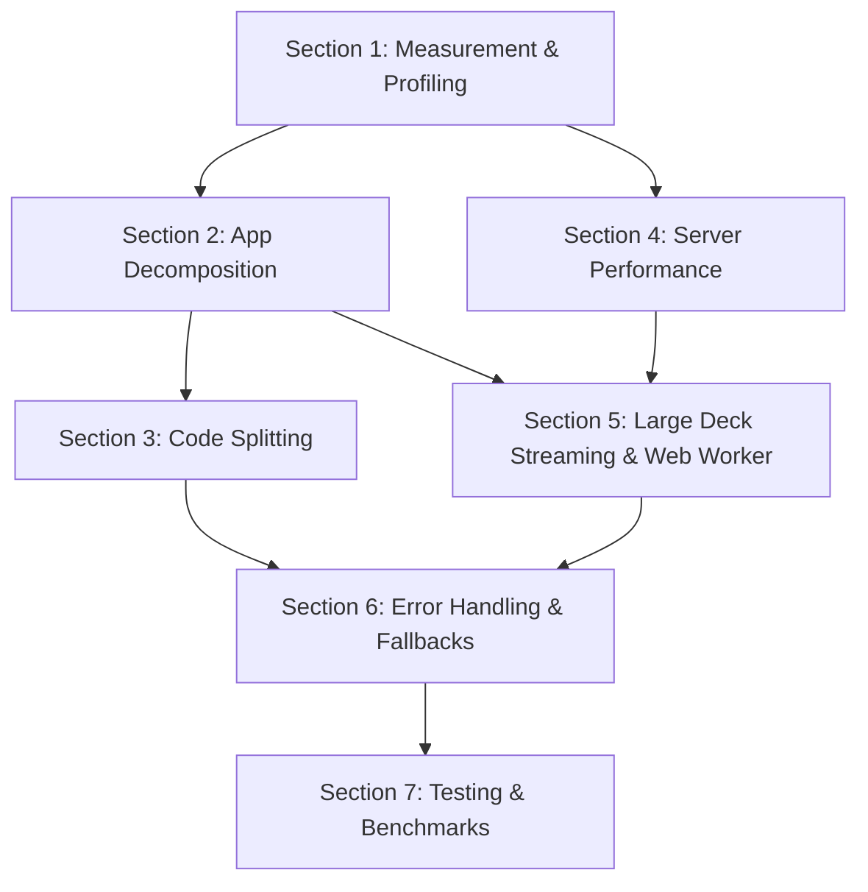

## Initial User Prompt

performance

## Description

A broad performance pass across the full DeckBridge stack: React rendering optimization via App.tsx decomposition, bundle size reduction via code splitting, server-side response compression and HTTP caching, and Web Worker offloading for heavy client computation. Every change must produce a measurable improvement against defined KPIs.

## Business Requirements

### User Stories

1. As a user, I want the app shell to load quickly so I can start working without staring at a spinner.
2. As a power user with a 10K+ card deck, I want card browsing and search to stay responsive at 60fps.
3. As a user on a slow connection, I want API responses compressed so data loads fast.
4. As a deck owner, I want the app to not freeze when doing SM-2 scheduling computations.
5. As a user, I want heavy views (analytics, discover, templates) to load only when I need them.
6. As a user, I want cached data when offline so the app is still usable.

### Acceptance Criteria

- Given the app loads, when the initial bundle is served, then the gzipped JS chunk is < 150KB.
- Given any API endpoint, when JSON is returned, then it is gzip-compressed and includes Cache-Control headers for read-only endpoints.
- Given a deck with 10K+ cards, when scrolling the card list, then frame rate stays at 60fps.
- Given the app starts, when heavy views are not yet opened, then their code is not loaded.
- Given the user navigates away from a view before data loads, then the in-flight request is cancelled.
- Given the API is unreachable, then the UI shows cached data with a stale indicator.
- Given `parseApkg` imports a large deck, then it processes cards in batches of 500 instead of loading the entire zip into memory.
- Given SM-2 scheduling runs, then it executes in a Web Worker and does not block the UI thread.

## Architecture Overview

### Strategy

Performance improvements span four layers: client rendering (React memoization + code splitting), server response (compression + caching), data handling (streaming + chunking), and computation offloading (Web Workers). Each change must be measurable against the defined KPIs.

### Components

1. **App Decomposition** - Extract inline components from `App.tsx` into `src/components/`, each with typed props and `React.memo`. Add route-based code splitting with `React.lazy`.

2. **Bundle Optimization** - Install `rollup-plugin-visualizer` for analysis, configure Vite for vendor/route/feature chunk splitting, tree-shake heavy imports.

3. **Server Performance** - Add `compression` middleware for gzip, add `Cache-Control` to read-only endpoints, add `web-vitals` to main.tsx for RUM.

4. **Large Deck Handling** - Batch processing in `parseApkg`, chunked sync, Web Worker for SM-2 scheduling.

5. **Error Handling & Fallbacks** - `AbortController` for request cancellation, retry with backoff, offline localStorage cache.

### KPI Targets

| Metric | Target | Tool |
|--------|--------|------|
| LCP | < 2.5s | `web-vitals` library |
| Card list scroll | 60fps at 10K cards | React DevTools profiler |
| Search/filter latency | < 100ms | Browser Performance API |
| API P95 | < 200ms (excl. AI) | Express timing middleware |
| Initial JS chunk | < 150KB gzipped | `rollup-plugin-visualizer` |
| App re-renders | No cascading re-renders | React DevTools flame graphs |

## Implementation Process

### Section 1: Measurement & Profiling Setup

Owner: backend + frontend executor.

Files:
- Create `server/timing.mjs`
- Modify `server/app.mjs`
- Modify `src/main.tsx`
- Modify `package.json`
- Modify `vite.config.ts`

Steps:
- [ ] Add request-timing middleware (`server/timing.mjs`) that records duration per route and exposes `X-Response-Time` header
- [ ] Install and configure `web-vitals` in `src/main.tsx` for real-user monitoring
- [ ] Install `rollup-plugin-visualizer` as a dev dependency
- [ ] Configure `rollup-plugin-visualizer` in `vite.config.ts` (produces `dist/stats.html`)
- [ ] Run baseline measurements and document in `PERF.md`

#### Verification

**Level:** Single Judge
**Artifact:** `server/timing.mjs`, `src/main.tsx` (web-vitals addition), `vite.config.ts`, `package.json`

**Rubric:**

| Criterion | Weight | Description |
|-----------|--------|-------------|
| Timing middleware | 0.30 | Records per-route duration, emits `X-Response-Time` header, does not block responses |
| web-vitals setup | 0.25 | `onCLS`, `onFCP`, `onLCP`, `onTTFB` called in main.tsx, results logged |
| visualizer setup | 0.20 | `rollup-plugin-visualizer` configured in vite.config.ts, produces `stats.html` |
| Package changes | 0.15 | `package.json` has `web-vitals` and `rollup-plugin-visualizer` without breaking existing deps |
| PERF.md baseline | 0.10 | Documents current bundle size, API latency, and render performance numbers |

**Threshold:** 4.0/5.0

### Section 2: App Decomposition & Render Optimization [CRITICAL]

Owner: frontend executor.

Files:
- Create `src/components/AuthScreen.tsx`
- Create `src/components/SyncHealthStrip.tsx`
- Create `src/components/OwnerAttentionPanel.tsx`
- Create `src/components/WorkbenchLayout.tsx`
- Create `src/components/OverviewRail.tsx`
- Create `src/components/CardRail.tsx`
- Create `src/components/ReviewWorkspace.tsx`
- Create `src/components/ReviewInspectionPanel.tsx`
- Create `src/components/ReviewDecisionBar.tsx`
- Create `src/components/ReviewQueueList.tsx`
- Create `src/components/ReviewQualitySummary.tsx`
- Create `src/components/ChangedFieldRows.tsx`
- Create `src/components/CardPreviewComparison.tsx`
- Create `src/components/DiffBlock.tsx`
- Create `src/components/EmptyState.tsx`
- Create `src/components/ToastStack.tsx`
- Create `src/components/ModelTemplateEditor.tsx`
- Create `src/components/ReviewRiskBadge.tsx`
- Create `src/components/Icon.tsx`
- Modify `src/App.tsx` — replace inline components with imports from `src/components/`
- Modify `src/types.ts` — ensure exports for shared types used by extracted components
- Add/update any necessary CSS imports

Steps:
- [ ] Extract `Icon` component to `src/components/Icon.tsx` with `React.memo`
- [ ] Extract `AuthScreen` to `src/components/AuthScreen.tsx`
- [ ] Extract `EmptyState` to `src/components/EmptyState.tsx` with `React.memo`
- [ ] Extract `SyncHealthStrip` to `src/components/SyncHealthStrip.tsx`
- [ ] Extract `OwnerAttentionPanel` to `src/components/OwnerAttentionPanel.tsx`
- [ ] Extract `WorkbenchLayout` to `src/components/WorkbenchLayout.tsx`
- [ ] Extract `OverviewRail` to `src/components/OverviewRail.tsx`
- [ ] Extract `CardRail` to `src/components/CardRail.tsx`
- [ ] Extract `DiffBlock` to `src/components/DiffBlock.tsx`
- [ ] Extract `ChangedFieldRows` to `src/components/ChangedFieldRows.tsx`
- [ ] Extract `ReviewRiskBadge` to `src/components/ReviewRiskBadge.tsx` with `React.memo`
- [ ] Extract `ReviewQualitySummary` to `src/components/ReviewQualitySummary.tsx` with `React.memo`
- [ ] Extract `ReviewQueueList` to `src/components/ReviewQueueList.tsx` with `React.memo`
- [ ] Extract `ReviewDecisionBar` to `src/components/ReviewDecisionBar.tsx`
- [ ] Extract `ReviewInspectionPanel` to `src/components/ReviewInspectionPanel.tsx`
- [ ] Extract `ReviewWorkspace` to `src/components/ReviewWorkspace.tsx`
- [ ] Extract `CardPreviewComparison` to `src/components/CardPreviewComparison.tsx`
- [ ] Extract `ToastStack` to `src/components/ToastStack.tsx`
- [ ] Extract `ModelTemplateEditor` to `src/components/ModelTemplateEditor.tsx`
- [ ] Replace inline `ReviewRiskBadge` rendering with component imports in all files
- [ ] Apply `React.memo` to all extracted components with stable props
- [ ] Apply `useMemo` to expensive derivations (filtered card lists, computed stats)
- [ ] Apply `useCallback` to event handlers passed as props to memoized children
- [ ] Verify the app still renders correctly — `npm run build` passes without errors
- [ ] Update `src/App.tsx` to import all components and remove inline definitions

#### Verification

**Level:** Panel of 2 Judges (critical step)
**Artifact:** All created `src/components/*.tsx` files, modified `src/App.tsx`

**Rubric:**

| Criterion | Weight | Description |
|-----------|--------|-------------|
| Component extraction | 0.30 | All 19 inline components extracted to own files with correct prop types |
| React.memo usage | 0.25 | `React.memo` applied to Icon, EmptyState, ReviewRiskBadge, ReviewQualitySummary, ReviewQueueList |
| No functionality loss | 0.25 | `src/App.tsx` builds without errors, all features continue to work |
| Prop type correctness | 0.20 | All extracted components have explicit TypeScript prop interfaces matching original usage |

**Threshold:** 4.5/5.0 (critical)

### Section 3: Code Splitting & Route-Based Lazy Loading [CRITICAL]

Owner: frontend executor.

Files:
- Modify `src/App.tsx` — wrap heavy views with `React.lazy`
- Modify `src/App.tsx` — add `Suspense` boundaries
- Modify `vite.config.ts` — configure manual chunks
- Modify `src/App.tsx` — vendor chunk separation

Steps:
- [ ] Wrap `AnalyticsDashboard` with `React.lazy(() => import('./AnalyticsDashboard'))` and `Suspense`
- [ ] Wrap `DiscoverView` with `React.lazy(() => import('./DiscoverView'))` and `Suspense`
- [ ] Wrap `TemplateGallery` with `React.lazy(() => import('./TemplateGallery'))` and `Suspense`
- [ ] Wrap `StudyView` with `React.lazy(() => import('./StudyView'))` and `Suspense`
- [ ] Configure Vite `build.rollupOptions.output.manualChunks` for vendor chunk (`react`, `react-dom`, `@supabase/supabase-js`)
- [ ] Add a loading fallback component for Suspense boundaries
- [ ] Verify `npm run build` produces separate chunks

#### Verification

**Level:** Panel of 2 Judges (critical step)
**Artifact:** Modified `src/App.tsx`, `vite.config.ts`

**Rubric:**

| Criterion | Weight | Description |
|-----------|--------|-------------|
| React.lazy wrapping | 0.30 | AnalyticsDashboard, DiscoverView, TemplateGallery, StudyView all wrapped |
| Suspense boundaries | 0.25 | Each lazy import has a Suspense boundary with loading fallback |
| Vendor chunk config | 0.25 | Vite config separates react/react-dom/supabase into stable vendor chunk |
| Build verification | 0.20 | `npm run build` completes, output includes separate chunk files |

**Threshold:** 4.0/5.0

### Section 4: Server-Side Performance

Owner: backend executor.

Files:
- Create `server/timing.mjs` (if not created in Section 1)
- Modify `server/app.mjs`
- Modify `server/index.mjs`
- Modify `package.json`

Steps:
- [ ] Install `compression` package
- [ ] Add `compression` middleware to Express app (after CORS, before routes)
- [ ] Add `Cache-Control: public, max-age=60` to `GET /api/decks`, `GET /api/decks/:id`, `GET /api/decks/:id/cards`
- [ ] Add request timing middleware that records duration and sets `X-Response-Time` header
- [ ] Verify `npm test` still passes

#### Verification

**Level:** Single Judge
**Artifact:** `server/app.mjs`, `server/timing.mjs`, `package.json`

**Rubric:**

| Criterion | Weight | Description |
|-----------|--------|-------------|
| Compression | 0.30 | Compression middleware enabled, responses have `Content-Encoding: gzip` |
| Cache headers | 0.25 | Read-only GET endpoints return `Cache-Control: public, max-age=60` |
| Timing middleware | 0.25 | Duration recorded, `X-Response-Time` header present |
| No regressions | 0.20 | All existing tests pass, no new dependencies break anything |

**Threshold:** 4.0/5.0

### Section 5: Large Deck Streaming & Web Worker

Owner: backend executor + frontend executor.

Files:
- Modify `server/ankiPackage.mjs` — batch processing
- Create `src/workers/sm2.worker.ts`
- Create `src/workers/search.worker.ts`
- Modify `src/sm2.ts`
- Modify `src/api.ts` — add `AbortController` support
- Modify `hooks/useSyncState.ts` or equivalent

Steps:
- [ ] Modify `parseApkg` to process cards in batches of 500 instead of loading the entire zip into memory
- [ ] Create Web Worker for SM-2 scheduling (`src/workers/sm2.worker.ts`) that receives card data and returns computed scheduling
- [ ] Create Web Worker for search/filter (`src/workers/search.worker.ts`) that performs tag and state filtering off the main thread
- [ ] Update `src/sm2.ts` to delegate computation to the Web Worker
- [ ] Update card filtering logic to use the search Web Worker
- [ ] Add `AbortController` to all API fetch calls in `src/api.ts`
- [ ] Implement request cancellation on component unmount / view change

#### Verification

**Level:** Panel of 2 Judges (critical step)
**Artifact:** `server/ankiPackage.mjs` (batch processing), `src/workers/sm2.worker.ts`, `src/workers/search.worker.ts`, `src/sm2.ts`, `src/api.ts`

**Rubric:**

| Criterion | Weight | Description |
|-----------|--------|-------------|
| Streaming import | 0.25 | parseApkg processes in batches of 500, partial imports discarded on interruption |
| Web Worker SM-2 | 0.25 | SM-2 scheduling runs in Web Worker, UI remains responsive |
| Web Worker search | 0.20 | Search/filter operations run off main thread |
| AbortController | 0.15 | All API fetches use AbortController, cancelled on view change |
| No regressions | 0.15 | `npm test` and `npm run test:api` still pass |

**Threshold:** 4.0/5.0

### Section 6: Error Handling & Fallbacks

Owner: frontend executor + backend executor.

Files:
- Modify `src/api.ts`
- Modify `src/App.tsx`
- Modify `src/hooks/useSyncState.ts` or equivalent
- Modify `server/app.mjs` (AI fallback verification)

Steps:
- [ ] Implement exponential backoff retry (1s, 2s, 4s, 8s, max 30s) with jitter for sync operations
- [ ] Add offline localStorage cache: cache last-loaded card list and deck metadata
- [ ] Show "stale" indicator when displaying cached data
- [ ] Verify AI features degrade gracefully when 9Router is unreachable (confirm existing patterns)

#### Verification

**Level:** Single Judge
**Artifact:** `src/api.ts`, `src/App.tsx`, any modified hooks

**Rubric:**

| Criterion | Weight | Description |
|-----------|--------|-------------|
| Retry with backoff | 0.30 | Sync retries use exponential backoff with jitter, progress shown to user |
| Offline caching | 0.30 | Card list and deck metadata cached in localStorage, shown with stale indicator |
| Cancellation | 0.25 | AbortController in api.ts, stale state updates prevented |
| AI degradation | 0.15 | Unreachable 9Router shows subtle indicator, doesn't block UI |

**Threshold:** 4.0/5.0

### Section 7: Testing & Benchmark Verification

Owner: test engineer.

Files:
- Create `PERF.md`
- Modify `server/routes.api.test.mjs` — add response time assertions
- Create `src/components/__tests__/renderCount.test.ts`
- Modify `tests/e2e/deckbridge.spec.ts` — add performance smoke tests

Steps:
- [ ] Record before/after benchmark results in `PERF.md` after each phase
- [ ] Add response-time assertions to API tests for paginated endpoints
- [ ] Add render count test for memoized components
- [ ] Add Playwright E2E performance smoke tests: load deck with 5000 cards, measure TTI; scroll virtual list, detect frame drops
- [ ] Verify all tests pass: `npm test`, `npm run test:api`, `npm run build`

#### Verification

**Level:** Single Judge
**Artifact:** `PERF.md`, `server/routes.api.test.mjs`, `src/components/__tests__/renderCount.test.ts`, `tests/e2e/deckbridge.spec.ts`

**Rubric:**

| Criterion | Weight | Description |
|-----------|--------|-------------|
| PERF.md benchmarks | 0.25 | Before/after measurements for bundle size, API latency, render performance |
| API latency tests | 0.20 | Paginated endpoints have response time assertions in API tests |
| Render count tests | 0.20 | Memoized components tested for re-render prevention |
| E2E perf smoke tests | 0.20 | Playwright tests for 5000-card load TTI and virtual scroll performance |
| All tests pass | 0.15 | `npm test`, `npm run test:api`, `npm run build` all pass |

**Threshold:** 4.0/5.0

## Parallelization Plan



Parallel lanes after Section 1:
- Lane A: App decomposition + code splitting (Sections 2 → 3)
- Lane B: Server-side performance (Section 4)
These converge before Section 5.

## Verification Plan

### Automated Tests

Run after each section:

```bash
npm test
npm run test:api
npm run build
```

Run before completion:

```bash
npm run test:e2e
```

## Definition of Done

- [ ] Request-timing middleware records per-route duration with `X-Response-Time` header
- [ ] `web-vitals` integrated in `src/main.tsx` for real-user monitoring
- [ ] All inline components extracted from `App.tsx` to `src/components/` with typed props and `React.memo` where appropriate
- [ ] Heavy views (`AnalyticsDashboard`, `DiscoverView`, `TemplateGallery`, `StudyView`) loaded via `React.lazy` with `Suspense` boundaries
- [ ] Vite configured with vendor chunk and `rollup-plugin-visualizer`
- [ ] `compression` middleware enabled in Express
- [ ] `Cache-Control: public, max-age=60` on read-only GET endpoints
- [ ] `parseApkg` processes cards in batches of 500
- [ ] SM-2 scheduling runs in a Web Worker
- [ ] All API fetches use `AbortController` for request cancellation
- [ ] Exponential backoff retry with jitter for sync operations
- [ ] Offline localStorage cache with stale indicator
- [ ] Before/after benchmarks recorded in `PERF.md`
- [ ] Render count tests for memoized components
- [ ] API latency assertions in route tests
- [ ] E2E performance smoke tests pass
- [ ] `npm test`, `npm run test:api`, `npm run build` all pass
- [ ] All KPI targets documented with current measurements
